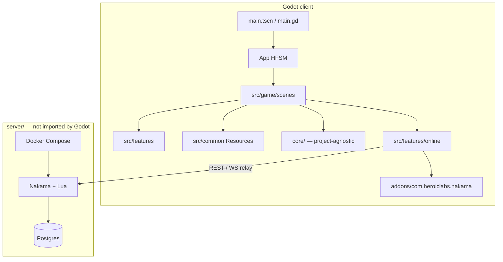

# Architecture

Side-view volleyball prototype on **Godot 4.7**. Offline AI / local 2P always work; online is optional.

## Layer map



## Folder roles

| Path | Role |
|------|------|
| `main.tscn` → `src/game/main.gd` | HFSM bootstrap |
| `src/game/scenes/` | Screens: `app_root`, `menu`, `game`, `post_battle` |
| `src/game/contexts/` | Platform BoundEntities (Desktop / Android / Steam / WEB / YandexGames) |
| `src/features/` | Isolated gameplay + online client |
| `src/common/` | Shared Resources (`GameConfig`, …) |
| `src/ui/` | Shared UI (loading screen) |
| `core/` | HFSM, FSM, EventListener, ResourceUtils, PerformanceTune |
| `server/` | Nakama + Postgres (Docker) |
| `addons/com.heroiclabs.nakama` | Official client; autoload `Nakama` |
| `addons/GodotSavesAddon` | Local saves — edit carefully |

## Contracts (critical)

### Scene isolation
Every scene must open alone in the editor without required autoloads/siblings.

- Defaults baked into `.tres` + `@export`
- Parents override via `initialize(data)` + `ResourceUtils.update_resource` / events

### Stable references
Prefer `class_name` and editor `@export` / PackedScene — avoid new hardcoded `res://` script paths.

### Feature isolation
One folder = one feature. Public surface: `ev_*` signals, `setup`/`initialize`, exported scenes.  
Features must not import other features' internals.

### `core/`
Must not depend on `src/`.

### Scenes
Orchestration only: wire features + config; do not bury gameplay rules in scene scripts beyond coordination.

## Target platforms

**Mobile**, **desktop**, **HTML5**. Input via InputMap. Touch (`virtual_controls`) is **P1 only**  
(left half move, right half jump) — local same-screen 2P is not dual-player touch.

## Progress / saves

```text
change → PData → RootEvents.ev_save_progress → SaveManager (disk)
                 └─ if online + session → OnlineService cloud sync (never blocks offline)
```

## Rules vs docs

| | `.cursor/rules/` | `.cursor/docs/` |
|--|------------------|-----------------|
| Style | Short must/never + globs | Prose + diagrams |
| Audience | Agent constraints | Humans + onboarding |
| Update | Same task as structural change | Same |
