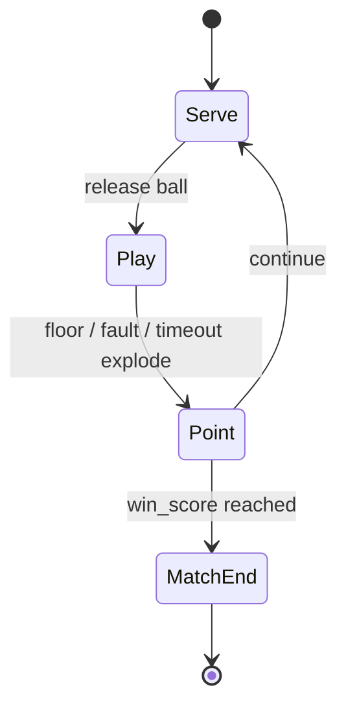

# Gameplay / match

## Ownership

| Concern | Owner |
|---------|--------|
| Orchestration / config apply | `game.gd` |
| Match transitions | `GameManager` FSM + `FSMGameEvents` |
| Score / serve / 3-touch fault | `MatchController` |
| Player feel | `src/features/blob_player/` |
| Ball physics | `src/features/ball/` |
| Bot | `src/features/ai_opponent/` |
| Touch UI | `src/features/virtual_controls/` |
| HUD | UI nodes listening to `GameEvents` |

Standalone defaults live on the scene’s `game_config.tres`; parents override via `initialize`.

## Match FSM

Do not drive win/lose with ad-hoc flags outside this FSM.

## GameEvents (in-match bus)

| Signal | Meaning |
|--------|---------|
| `ev_game_state_changed` | FSM transition |
| `ev_score_changed` | Left/right scores |
| `ev_point_scored` | Side that conceded / scored context |
| `ev_match_over` | Winner side |
| `ev_message` | Banner text |
| `ev_round_time_changed` | Rally seconds left |

## Court / players

- Side view, Z locked. Blue = left (`player_index` 0), Red = right (1).
- Each blob clamped to own half (`NET_LIMIT_X`).
- Offline P1: `p1_*` (+ touch). Offline P2: `p2_*` / pad1.
- Online: both local inputs use **`p1_*`**; `GameConfig.local_side` chooses which blob.

## Last-chance blast

- `BlobPlayer.try_last_chance()` — once per rally, only if ball on own half.
- Local offline: primarily Blue / P1 charge rules; online both sides get a charge (`allow_last_chance`).
- Touchscreen: BOOM button on `VirtualControls`.
- Destroy → invisible until `prepare_round()` (host) or authority snap revive (guest).

## AI

`AiOpponent.setup(right, ball, enabled)` sets `external_axis` / jump.  
Online battles must call this **before** `OnlineMatchSync.setup` so sync can force `use_player_input = false` on both blobs (AI `setup(false)` otherwise re-enables keyboard mode on Red).

## Touch controls

- Left half: analog drag → move  
- Right half: hold → jump  
- Not dual-player touch for local 2P  

## Exit

Leave match via `root_events.ev_exit_game` with post-battle payload (scores, ranked flags, etc.).
