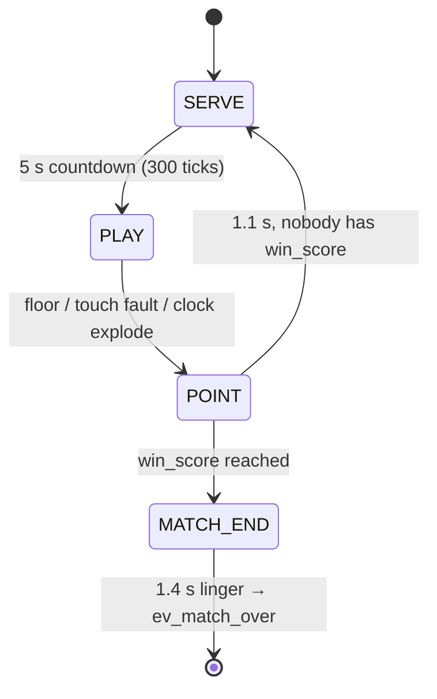

# Gameplay / match

The whole match is one **deterministic simulation** (`VolleySim`). Nodes only feed it input and
draw its state. See [simulation.md](simulation.md) for the determinism rules.

## Ownership

| Concern | Owner |
|---------|--------|
| Rules, physics, scoring, phases, timer, blast | `src/features/volley_sim/volley_sim.gd` (`VolleySim`) |
| Input → sim format (`{x, j, b}`) | `src/features/player_input/` (`PlayerInput`) |
| Bot | `src/features/ai_opponent/` (`AiOpponent`, pure function of sim state) |
| Feeding the sim, match-over event | `MatchRunner` (`src/game/scenes/game/game_logic/`) |
| Drawing + HUD + FX | `MatchView` (same folder) + `BlobView` / `BallView` features |
| Touch UI | `src/features/virtual_controls/` |
| Orchestration / config apply | `game.gd` |
| Online | `OnlineRollback` (`src/features/online/`) — see [online.md](online.md) |

Standalone defaults live on the scene’s `game_config.tres`; parents override via `initialize`.

## Phases (inside the sim)

```mermaid
stateDiagram-v2
  [*] --> SERVE
  SERVE --> PLAY: 5 s countdown (300 ticks)
  PLAY --> POINT: floor / touch fault / clock explode
  POINT --> SERVE: 1.1 s, nobody has win_score
  POINT --> MATCH_END: win_score reached
  MATCH_END --> [*]: 1.4 s linger → ev_match_over
```

Tick rate is fixed at 60 Hz. Never drive win/lose with flags outside the sim state.

## Court / players

- Side view, one plane. Blue = left (index 0), Red = right (1). Each blob stays on its half.
- Offline P1: `p1_*` (+ touch). Offline P2: `p2_*` / pad1. Online: the local human always uses **`p1_*`**; `GameConfig.local_side` picks the blob.
- Court geometry in the sim (`WALL_X`, `CEILING_Y`, net) must match the visual Court nodes in `game.tscn`.

## Last-chance blast

- `b` input is **edge-triggered** in the sim; once per rally, only while the ball is live and on the blob's own half.
- Offline: Blue only. Online: both sides. Revived and recharged at every serve.
- Touchscreen: BOOM button (`VirtualControls.ev_self_destruct_requested` → `MatchRunner.request_blast`).

## Presentation rules

- `MatchView` reads `runner.sim.s` only. FX are edge-detected from `*_serial` counters in state
  (`touch`, `point`, `blast`, `explode`) so rollbacks can never replay or lose an effect.
- Offline the view interpolates between the last two ticks; online it shows the raw state.
- HUD text comes from `Msg` codes + phase (`MatchView._message_for`), not from events.

## AI

`AiOpponent.decide(state) -> input`. `side` selects which blob it drives (default right).
Used for `vs_ai` and in bot-vs-bot tests (`tests/cases/test_gameplay.gd`).

## Touch controls

- Left half: analog drag → move; right half: hold → jump. Not dual-player touch for local 2P.

## Exit

`MatchRunner.ev_match_over(payload)` → `game.gd` → `root_events.ev_exit_game` (scores, ranked flags, …).
