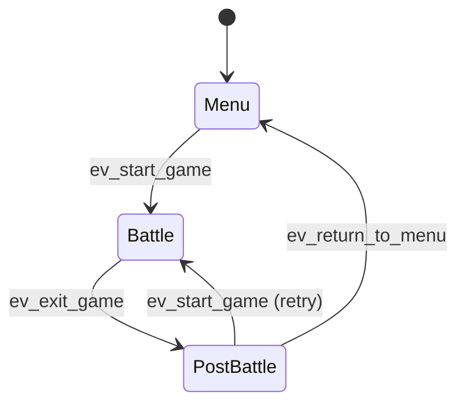
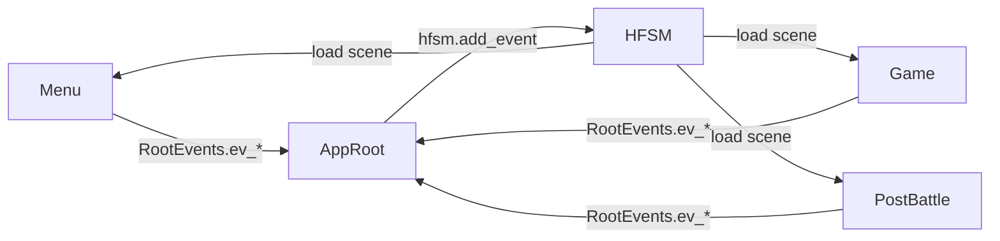

# Navigation & app HFSM

## Screen flow



Platform states are **siblings** of Menu (not parents):  
`DESKTOP` | `ANDROID` | `STEAM` | `WEB` (+ nested `YandexGames`).

## Wiring



| Piece | Path |
|-------|------|
| Entry | `main.tscn` → `src/game/main.gd` |
| HFSM config | `src/game/hfsm/app_hfsm.json` |
| Scene paths | `HfsmScenePaths` |
| Bridge | `app_root` maps `RootEvents` → HFSM |
| Entities | `main.gd` registers platform contexts |

## RootEvents (app bus)

| Signal | Typical use |
|--------|-------------|
| `ev_start_game(data)` | Enter battle; payload includes `custom_battle: GameConfig` |
| `ev_exit_game(data)` | Leave battle → post-battle with result |
| `ev_return_to_menu(data)` | Back to menu |
| `ev_save_progress` | Persist `PData` via SaveManager |
| `ev_battle_started` / `ev_battle_finished` | Lifecycle hooks |
| `ev_reset_account_progress` | Clear progress |

### Battle start payload

```text
{
  "custom_battle": GameConfig,   # required shape
  "online": bool,                # optional override
  "ranked": bool,
  "local_side": 0|1,
  "local_display_name": String
}
```

Offline:

- Human: `vs_ai = false`
- AI: `vs_ai = true`

Online: set after rooms/MM when 2 peers are connected; `local_side = 0` if `multiplayer.is_server()` else `1`.

## Platform open (from AppRoot)

| Host | Event | State |
|------|-------|-------|
| Steam | `ev.open_steam` | `STEAM` |
| Android | `ev.open_android` | `ANDROID` |
| Web / Yandex | `ev.open_web` | `WEB` (+ YandexGames if needed) |
| else | `ev.open_desktop` | `DESKTOP` |

## Avoid

- Instantiating `Game` scene from menu scripts directly (always go through RootEvents / HFSM)
- Building full UI trees in code when a `.tscn` template works
