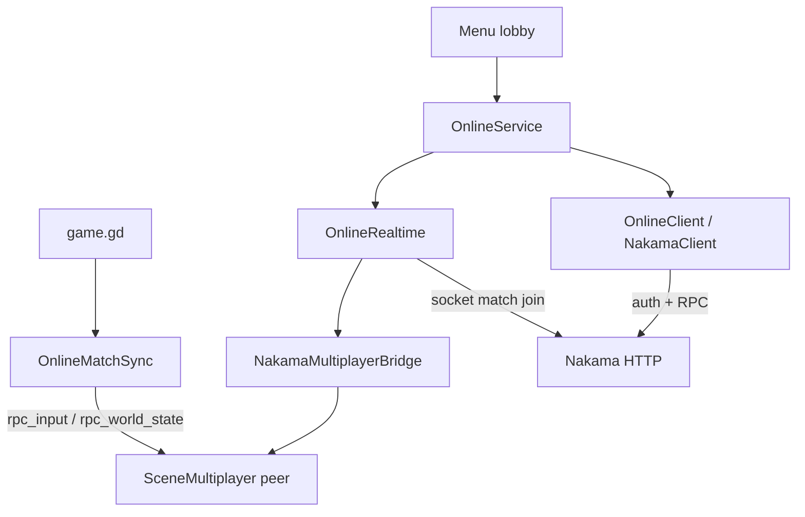
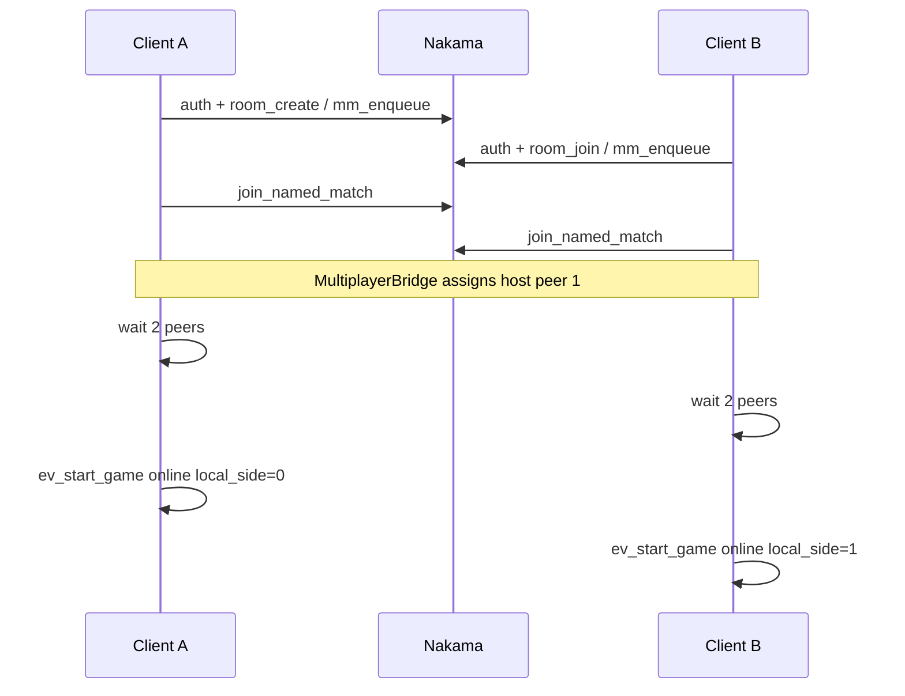
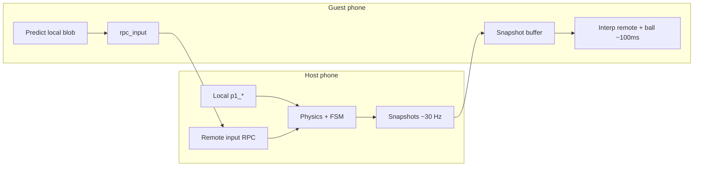

# Online (client)

Feature: `src/features/online/`. Addon: `addons/com.heroiclabs.nakama` (autoload `Nakama`).  
Offline AI / local 2P must never require this feature.

## Stack



## Pieces

| Piece | Role |
|-------|------|
| `OnlineEndpoints` | LAN `HOST` / ports / `SERVER_KEY` for phone→PC testing |
| `OnlineConfig` | Resource defaults (can override endpoints) |
| `OnlineService` | Auth, progress, rooms, MM, auto realtime join |
| `OnlineClient` | SDK-only auth + `rpc_async` |
| `OnlineRealtime` | Socket from same client + bridge |
| `OnlineMatchSync` | Listen-server gameplay sync |
| `PlatformAuth*` | Device / Google / Steam / Yandex |
| `DevAccounts` | Debug users A–D |

## Lobby flow (menu)



1. Dev account (or platform auth) → Sign in  
2. Create Room / Join code / Find Ranked  
3. Wait until 2 peers  
4. `ev_start_game` with `online`, `local_side`, optional `ranked`, display name  
5. Host runs `GameManager`; guest does **not** — HUD/world from sync  

Rooms / MM return `match_name` (`gb_room_*` / `gb_mm_*`); service can auto `join_named_match`.

## CS listen-server sync

Host (peer 1) = authority for physics + match FSM. Guests are thin clients for the world.



| Concern | Host | Guest |
|---------|------|-------|
| Own blob | Immediate | Client-side prediction + soft reconcile |
| Remote blob / ball | Simulated | Delayed snapshot interpolation |
| Match FSM / score | Owns | Receives via HUD / state snaps |
| Boom / revive | `prepare_round` | Latest authority life flags (not interp frame) |

Implementation: `OnlineMatchSync` (`INTERP_DELAY_SEC`, snapshot buffer, `_rpc_input`, `_rpc_world_state`).

**Not yet:** dedicated Nakama match authority, lag compensation, full input history reconcile.  
`goofy_match` Lua handler remains a stub for later ranked authority.

## Local testing

```powershell
cd server
docker compose up -d
.\scripts\smoke_rooms.ps1
.\scripts\smoke_matchmaker.ps1
```

Set `OnlineEndpoints.HOST` to the PC LAN IP when testing phones.  
F6 `online_smoke.tscn` — API smoke without full battle UI.

Also see `src/features/online/README.md`.
