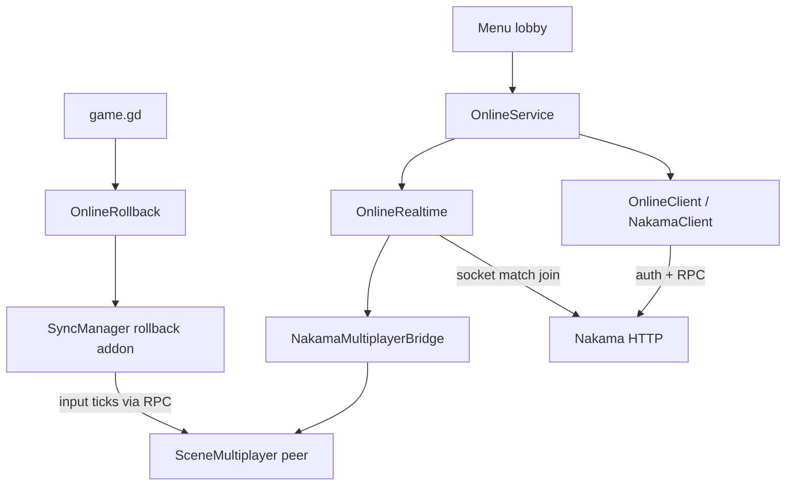
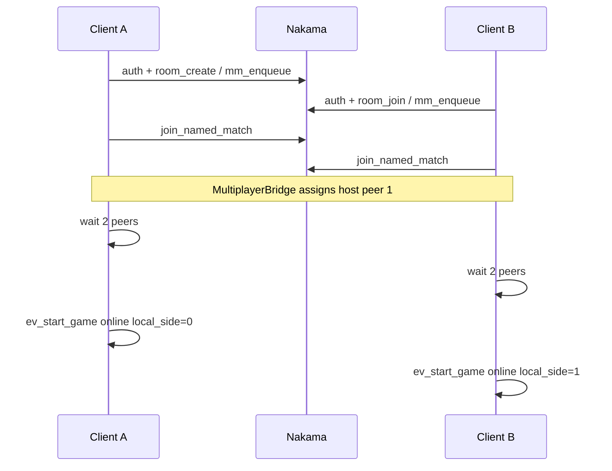
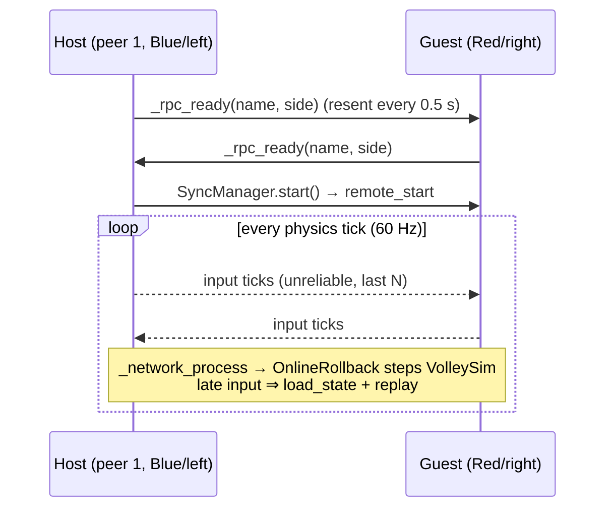

# Online (client)

Feature: `src/features/online/`. Addon: `addons/com.heroiclabs.nakama` (autoload `Nakama`).  
Offline AI / local 2P must never require this feature.

## Stack


```mermaid
flowchart TB
  Menu[Menu lobby] --> Service[OnlineService]
  Service --> Client[OnlineClient / NakamaClient]
  Service --> RT[OnlineRealtime]
  RT --> Bridge[NakamaMultiplayerBridge]
  Bridge --> Peer[SceneMultiplayer peer]
  Game[game.gd] --> Roll[OnlineRollback]
  Roll --> SM[SyncManager rollback addon]
  SM -->|input ticks via RPC| Peer
  Client -->|auth + RPC| Nakama[Nakama HTTP]
  RT -->|socket match join| Nakama
```

## Pieces

| Piece | Role |
|-------|------|
| `OnlineEndpoints` | Host/port/key from env or `user://online.cfg` (default `127.0.0.1`) |
| `OnlineConfig` | Resource defaults (can override endpoints) |
| `OnlineService` | Auth, progress, rooms, MM, auto realtime join |
| `OnlineClient` | SDK-only auth + `rpc_async` |
| `OnlineRealtime` | Socket from same client + bridge |
| `OnlineRollback` | Rollback netcode glue (handshake, input nodes, state callbacks) |
| `PlatformAuth*` | Device / Google / Steam / Yandex |
| `DevAccounts` | Debug users A–D |

## Lobby flow (menu)


```mermaid
sequenceDiagram
  participant A as Client A
  participant N as Nakama
  participant B as Client B
  A->>N: auth + room_create / mm_enqueue
  B->>N: auth + room_join / mm_enqueue
  A->>N: join_named_match
  B->>N: join_named_match
  Note over A,B: MultiplayerBridge assigns host peer 1
  A->>A: wait 2 peers
  B->>B: wait 2 peers
  A->>A: ev_start_game online local_side=0
  B->>B: ev_start_game online local_side=1
```

1. Dev account (or platform auth) → Sign in  
2. Create Room / Join code / Find Ranked  
3. Wait until 2 peers  
4. `ev_start_game` with `online`, `local_side`, optional `ranked`, display name  
5. Both peers run the same `VolleySim`; `OnlineRollback` syncs inputs (host = peer 1 = left, guest = right)  

Rooms / MM return `match_name` (`gb_room_*` / `gb_mm_*`); service can auto `join_named_match`.

## Rollback netcode

Both peers simulate the **whole** match locally (`VolleySim`) and exchange only inputs.
`SyncManager` (autoload, `addons/godot-rollback-netcode`) predicts the remote input, and when the
real input arrives and differs it loads the saved state and re-simulates — invisible to the player.
Transport is the Nakama `MultiplayerBridge` peer (`RPCNetworkAdaptor`, plain Godot RPCs) — no WebRTC.


```mermaid
sequenceDiagram
  participant H as Host (peer 1, Blue/left)
  participant G as Guest (Red/right)
  H->>G: _rpc_ready(name, side)  (resent every 0.5 s)
  G->>H: _rpc_ready(name, side)
  H->>G: SyncManager.start() → remote_start
  loop every physics tick (60 Hz)
    H-->>G: input ticks (unreliable, last N)
    G-->>H: input ticks
    Note over H,G: _network_process → OnlineRollback steps VolleySim<br/>late input ⇒ load_state + replay
  end
```

| Piece | Role |
|-------|------|
| `RollbackInput` ×2 | One per side; authority = that side's peer; `_get_local_input()` samples `PlayerInput` |
| `OnlineRollback` | `_network_postprocess` steps the sim; `_save_state`/`_load_state` snapshot it |
| `MatchRunner.over_gate` | Match result is only reported once the tick's inputs are confirmed |
| Project settings | `[network] rollback/*` in `project.godot` (input delay 3 ticks, buffer 30) |

Failure handling: opponent disconnect / `sync_error` → `ev_aborted` → menu (or the result if the
match was already decided). State-hash mismatches are logged (`remote_state_mismatch`).

**Not yet:** server-side result verification for ranked, reconnect, spectators.

## Local testing

```powershell
cd server
docker compose up -d
.\scripts\smoke_rooms.ps1
.\scripts\smoke_matchmaker.ps1
```

On a phone, point it at your PC / server: create `user://online.cfg` with `[nakama]` `host="192.168.x.x"` (or set `GOOFY_NAKAMA_HOST`).  
F6 `online_smoke.tscn` — API smoke without full battle UI.

Also see `src/features/online/README.md`.
